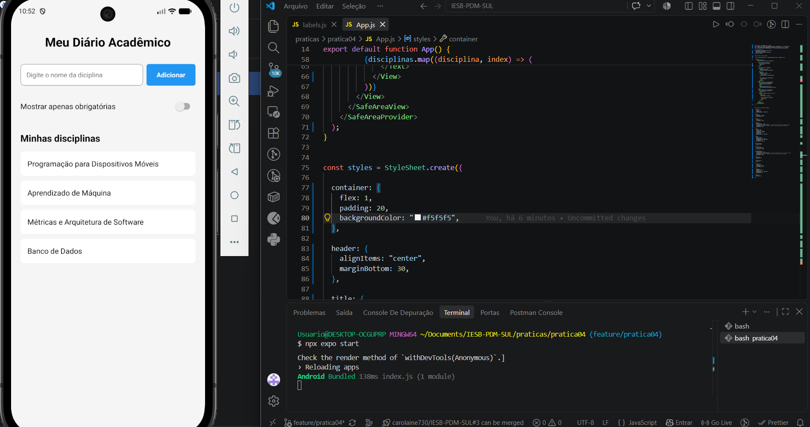

# Meu Diário Acadêmico

Atividade desenvolvida para a disciplina de **Programação para Dispositivos Móveis**, utilizando React Native e Expo.

**Professor:** Marcelo Alves Farias
**IESB**

## Objetivo

Desenvolver uma tela inicial para cadastro de disciplinas utilizando os principais conceitos estudados em React Native.

Foram utilizados:

* Core Components: ão os componentes básicos fornecidos pelo React Native para construir a interface.  Neste projeto foram utilizados componentes como View, Text, TextInput, Pressable e Switch.

* Import e Export: permitem organizar o código em arquivos diferentes e reutilizar informações entre eles. Neste projeto, os textos da aplicação foram declarados no arquivo labels.js e importados para o App.js.

* StyleSheet: recurso utilizado para criar e organizar os estilos dos componentes, como tamanho de fonte, espaçamento, cores, bordas e alinhamento.

* Flexbox: sistema de organização de layout utilizado pelo React Native. Foi usado para controlar o posicionamento dos elementos, como deixar o campo de texto e o botão lado a lado.

* SafeAreaView: mantém o conteúdo da aplicação dentro de uma área segura da tela, evitando que textos e componentes fiquem escondidos pela barra de status, câmera ou outras áreas do dispositivo.

* Dimensões com `flex` e porcentagem: utilizados para criar um layout mais adaptável a diferentes tamanhos de tela. O flex permite que os componentes ocupem o espaço disponível, enquanto valores em porcentagem definem larguras proporcionais, como 70% para o campo de texto e 28% para o botão.

* Pressable: componente utilizado para criar o botão "Adicionar". Ele permite identificar quando o usuário está pressionando o botão e aplicar um efeito visual durante essa interação.

* Switch: componente utilizado para representar uma opção de ligar ou desligar. Neste projeto foi utilizado na opção "Mostrar apenas obrigatórias", ainda sem realizar o filtro real da lista, conforme permitido na atividade.


## Criação do projeto

O projeto foi criado utilizando o comando:

```bash
npx create-expo-app@latest . --template blank
```

Também foi instalada a biblioteca:

```bash
npx expo install react-native-safe-area-context
```

## Executando o projeto

Para iniciar a aplicação:

```bash
npx expo start
```

## Funcionalidades

A aplicação possui:

* Cabeçalho com o nome **Meu Diário Acadêmico**
* Campo para digitar o nome de uma disciplina
* Botão **Adicionar**
* Lista estática de disciplinas
* Layout utilizando Flexbox
* `SafeAreaView`
* Botão utilizando `Pressable`
* Efeito visual ao pressionar o botão
* `Switch` para "Mostrar apenas obrigatórias"

O Switch foi implementado como demonstração de componente e ainda não realiza filtro na lista, conforme permitido pelo enunciado da atividade.

## Tela da aplicação



## Tecnologias utilizadas

* React Native
* Expo
* JavaScript


## Observação sobre a estrutura do projeto

Antes da criação do projeto Expo, a pasta `pratica04` já possuía um arquivo `README.md` com orientações anteriores da disciplina.

Como o comando utilizado para criar o projeto:

```bash
npx create-expo-app@latest . --template blank
```

exige que a pasta esteja vazia, o arquivo original foi movido temporariamente para fora da pasta `pratica04` e renomeado para:

```text
README_pratica04_original.md
```

Esse arquivo foi mantido apenas como backup e referência das instruções anteriores.

O `README.md` localizado atualmente dentro de `pratica04` corresponde à documentação desta atividade, contendo a descrição do projeto, recursos utilizados, comandos de execução e imagens da aplicação.
